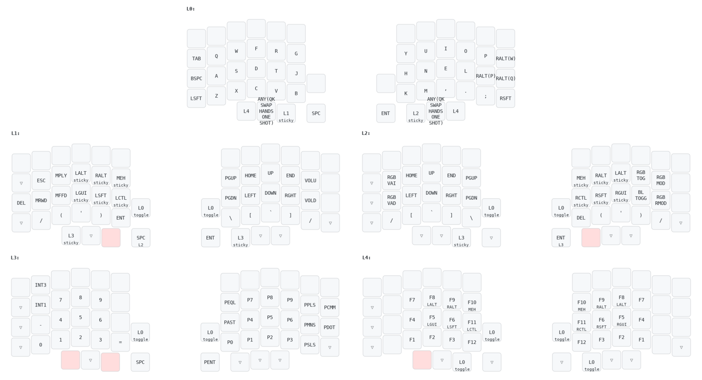

# Plywood keymap

This keyboard userspace configuration is designed for a Lily58 and the code is based on splitkb's Aurora Lily58.

The userspace contains two different keymaps:

## Seniply

The design is loosly based on [Seniply](https://stevep99.github.io/seniply/) even tho it has diverged over time. It currenly also embeds [Tarmak-2](https://forum.colemak.com/topic/1858-learn-colemak-in-steps-with-the-tarmak-layouts/).

## Plywood

A new layout based on the need for symmetry.

