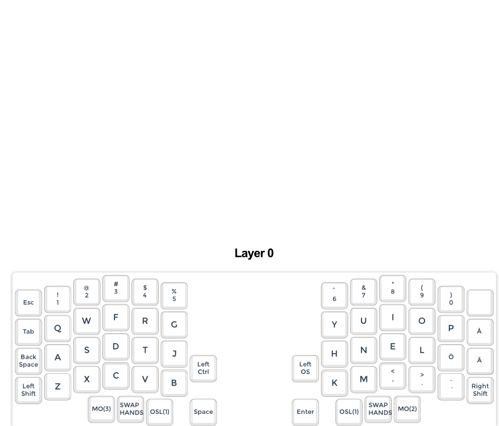
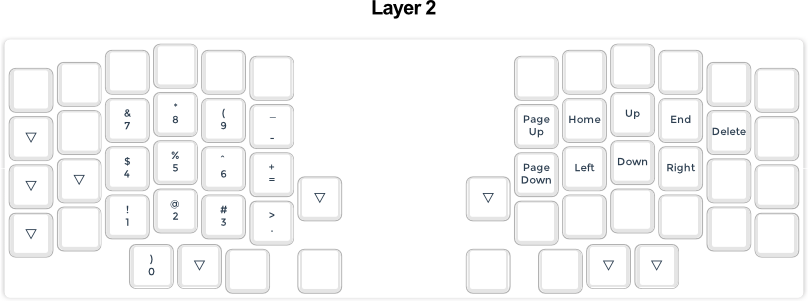

# Plywood keymap

This keyboard userspace configuration is designed for a Lily58 and the code is based on splitkb's Aurora Lily58.

The userspace contains two different keymaps that uses tarmak-2 layout:

## Seniply

The design is loosly based on [Seniply](https://stevep99.github.io/seniply/) even tho it has diverged over time. It currenly also embeds [Tarmak-2](https://forum.colemak.com/topic/1858-learn-colemak-in-steps-with-the-tarmak-layouts/).

## Plywood

A new layout based on the need for symmetry. The core conceit is that you have a left and right layer that mirrors each other, so when you activate left layer you have navigation on the right hand side and oneshot modifiers on the left, and when you activate the right layer it's the other way around. This allows for lesser cognitive load on the memory while also making all useful keys accessible one-handed, to the cost of some redundancy and keys that probably will go largely unused.


## Plywood 2

Lessons from Plywood:
- Having a left-right tap that uses just two different keys in either direction (left+right = right+left) tends to cause a layer lock if the first key pressed isn't released.
- Symmetry is very unuseful, but hand-swap works rather well instead.
- Number row is very handy even tho a num layer is much nicer to use in most cases.
- OSL to LT works well but OLS key has to be held past hold for LT to trigger

The plan for the new layout was as follows:

The following keys needs to be reachable and how "far away" they can be:
```
<esc>           Layer
<backspace>     Prim
<delete>        Layer
`               Layer
~ (shifted `)   Layer+Shift
! (shifted 1)   Shift(stretch)/Double layer
@ (shifted 2)   "
# (shifted 3)   "
$ (shifted 4)   "
% (shifted 5)   "
^ (shifted 6)   "
& (shifted 7)   "
* (shifted 8)   "
( (shifted 9)   Shift(stretch)/Layer
) (shifted 0)   Shift(stretch)/Layer
-               Layer
_ (shifted -)   Layer+Shift
=
+ (shifted =)   Layer+Shift
[               Layer
{ (shifted [)   Layer+Shift
]               Layer
} (shifted ])   Layer+Shift
,               Prim
< (shifted ,)   Shift
.               Prim
> (shifted .)   Shift
;               Layer
: (shifted ;)   Layer+Shift
\               Layer
| (shifted \)   Layer+Shift
/               Layer
? (shifted /)   Layer+Shift
'               Prim
" (shifted ')   Shift
<up>            Layer
<down>          "
<left>          "
<right>         "
<pgup>          Double-layer
<pgdown>        Double-layer
<home>          Double-layer
<end>           Double-layer
<keypad>        Layer
<f-keys>        Layer
<media keys>    Double-layer
<keyboard color controls> Double-layer
```

The layout turned out as follows, with a lot fewer layers.





There is definitely still some probelms that needs to be adressed:
- With the movement keys taking up the homerow on layer 1 now the OSM shift ends up on the upper row instead of right under the pointer fingers.
  - Possible solutions:
    - Get used to it
      - The problem is slightly lesser when actually managing to activate the modifier with the other hand. Something that is slightly easier now that the keyboard isn't trying to be symmetrical.
    - Move the movement keys down one row to have them in a slightly more traditional position.
      - This would give the added benefit of not having to curl the fingers as much to reach all of the special characters on the lower row.
      - On the other hand this would move the navigation keys out of the position I'm used to and how it aligns with the keypad.
    - Move movement keys to a new layer
      - Could have a 3x3 with the regular numbers on the opposite side for ease of access 